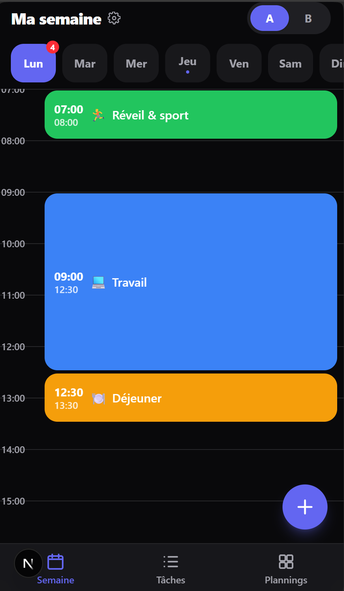
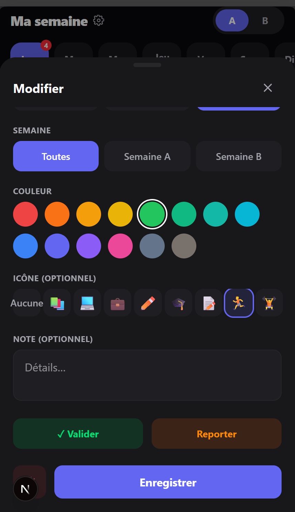
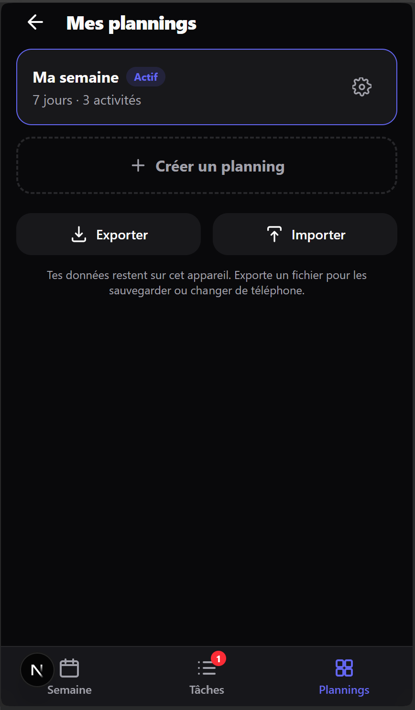
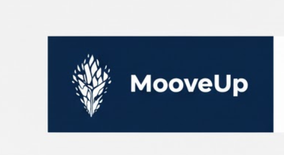
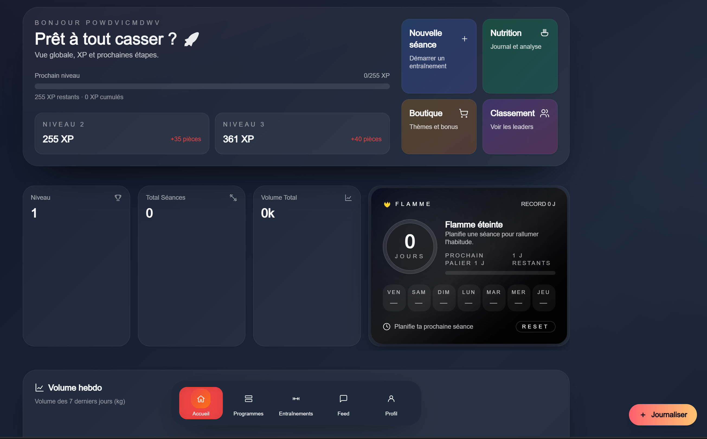
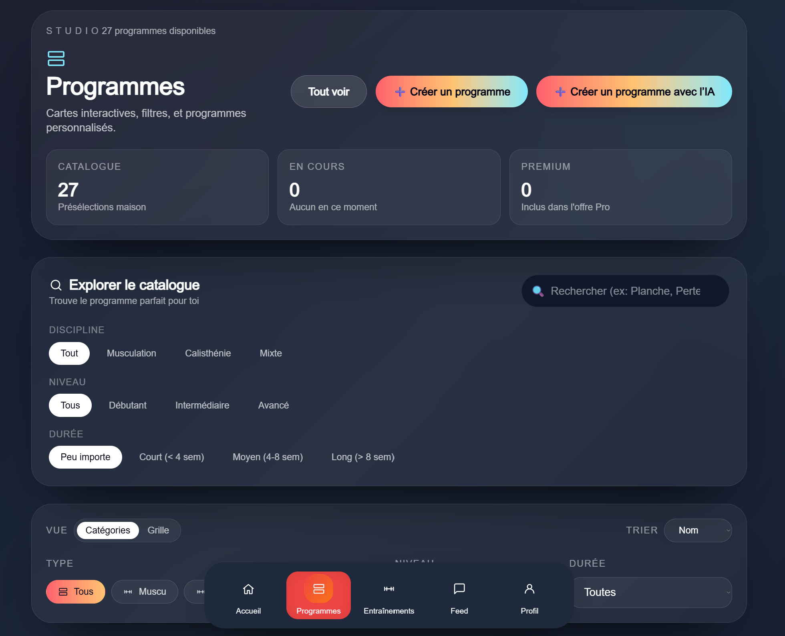
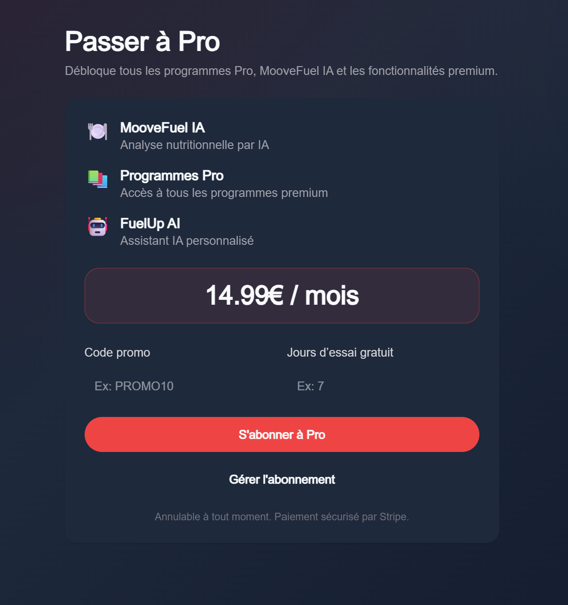
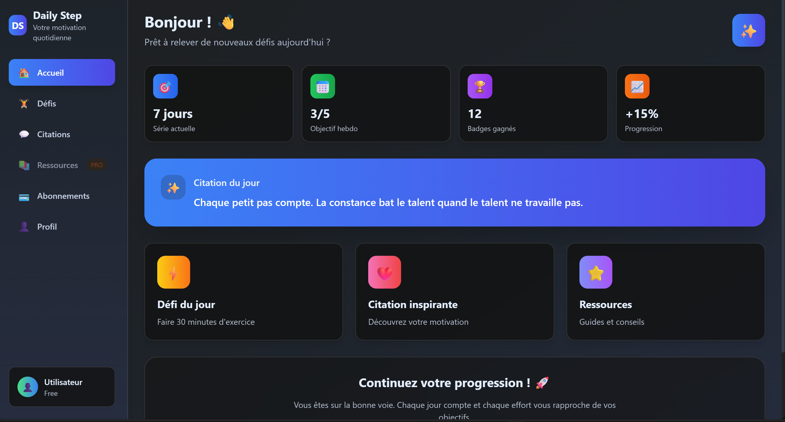

# Mes projets

Étudiant en B1 Informatique à Ynov Campus Aix-en-Provence. Je conçois des applications web et mobiles en m'appuyant sur des outils d'IA pour coder plus vite. Ici, je présente les projets. Le code reste privé et je le montre volontiers sur demande.

---

## Weeko · emploi du temps de la semaine

  

Une app pour organiser sa semaine sur téléphone, sans créer de compte. On place ses activités sur une grille horaire, on alterne semaine A et semaine B, on coche ce qui est fait, et le reste part dans une liste de tâches.

- Installable sur le téléphone et utilisable hors-ligne (PWA)
- Toutes les données restent sur l'appareil, sans serveur
- Plusieurs plannings, sauvegarde et restauration par fichier

**Stack :** Next.js, React, TypeScript, Tailwind CSS, IndexedDB

---

## AmbientCare · compte-rendu médical assisté par IA

<!-- vidéo de démo : enregistrement → compte-rendu -->

Une maquette d'app mobile pour médecins hospitaliers. Le médecin enregistre la consultation, la transcription s'affiche en direct, puis une IA rédige un compte-rendu structuré que le médecin relit et valide avant que la famille soit prévenue. Les patients sont fictifs.

- Parcours complet en 5 écrans
- Serveur relais qui protège la clé d'API
- Mode secours pour une démo fiable sans connexion à l'IA

**Stack :** HTML, CSS, JavaScript, Node.js, API Claude

---

## MooveUp+ · app fitness pour athlètes hybrides

 

Une application complète d'entraînement : programmes (dont certains générés par IA), suivi des séances, coach nutrition conversationnel, défis, badges, classement et fil social, avec abonnements payants.

- Une quarantaine d'écrans, en français et en anglais
- Paiement et abonnements, comptes utilisateurs, base de données sécurisée
- Export des données personnelles (RGPD), accessibilité, tests de bout en bout
- Travail produit en parallèle : specs, plan de lancement, modèle économique

**Stack :** Next.js, React, TypeScript, Supabase, Stripe, OpenAI, Three.js, Playwright

---

## Daily-Step · motivation au quotidien

Mon premier projet : une app de motivation avec citation du jour, défis par catégorie, séries de jours, points d'expérience, niveaux et badges.

**Stack :** Next.js, React, TypeScript, Tailwind CSS, shadcn/ui

---

## Down of Gopher · projet d'école

Jeu de rôle en ligne de commande écrit en Go, en équipe de trois, pour le projet RED d'Ynov. [Voir le dépôt](https://github.com/Juuuules83/Projet-RED-RAPH-ALEX-JULES)

**Stack :** Go
