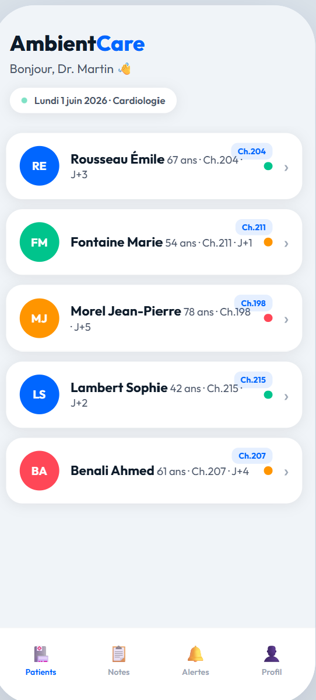
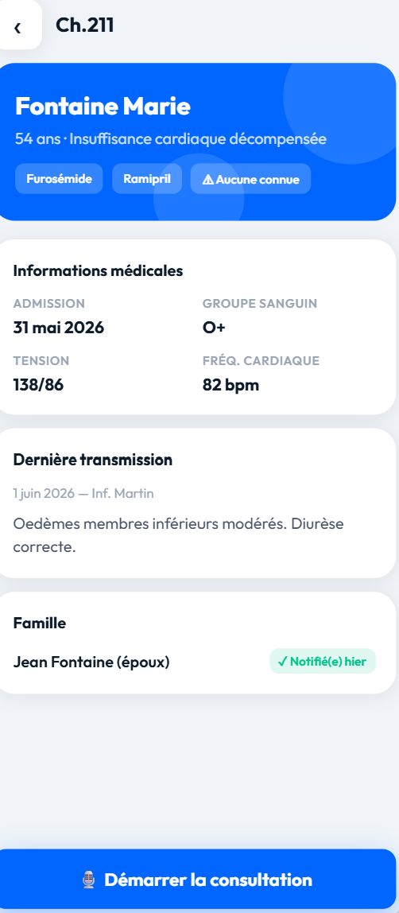
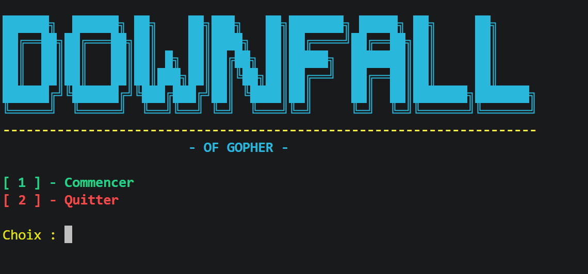
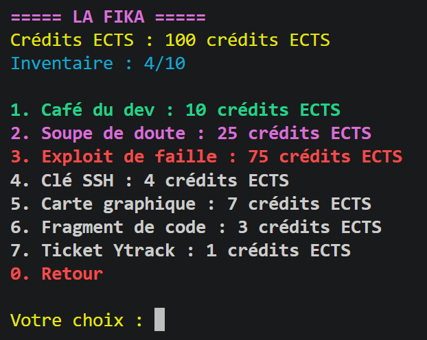
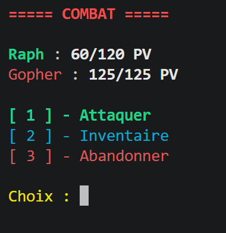

# Mes projets

Étudiant en B1 Informatique à Ynov Campus Aix-en-Provence. Je conçois des applications web et mobiles en m'appuyant sur des outils d'IA pour coder plus vite.

Les quatre applications ci-dessous sont des **prototypes personnels** : des projets d'apprentissage pour tester une idée et une technologie, pas des produits en ligne. Chaque fiche indique ce qui fonctionne et ce qui reste à faire. Le code reste privé et je le montre volontiers sur demande.

---

## Weeko · emploi du temps de la semaine

> **Prototype personnel** · juin 2026 · le plus abouti, utilisable au quotidien

  

Une app pour organiser sa semaine sur téléphone, sans créer de compte. On place ses activités sur une grille horaire, on alterne semaine A et semaine B, on coche ce qui est fait, et le reste part dans une liste de tâches.

- Installable sur le téléphone et utilisable hors-ligne (PWA)
- Toutes les données restent sur l'appareil, sans serveur
- Plusieurs plannings, contrôle des chevauchements, sauvegarde et restauration par fichier

**Ce qui manque encore :** la synchronisation entre plusieurs appareils et des tests automatisés.

**Stack :** Next.js, React, TypeScript, Tailwind CSS, IndexedDB

---

## AmbientCare · compte-rendu médical assisté par IA

> **Prototype de démonstration** · juin 2026 · patients fictifs

 

Une maquette d'app mobile pour médecins hospitaliers. Le médecin enregistre la consultation, la transcription s'affiche en direct, puis une IA rédige un compte-rendu structuré que le médecin relit et valide avant que la famille soit prévenue.

- Parcours complet en 5 écrans
- Serveur relais qui protège la clé d'API
- Mode secours pour une démo fiable sans connexion à l'IA

**Ce qui manque encore :** l'enregistrement audio est simulé, sans vraie reconnaissance vocale. Ce n'est pas un outil médical et il n'est pas destiné à de vrais patients.

**Stack :** HTML, CSS, JavaScript, Node.js, API Claude

---

## MooveUp+ · app fitness pour athlètes hybrides

> **Prototype personnel** · octobre-novembre 2025 · le projet le plus ambitieux

 

Une application d'entraînement complète : programmes (dont certains générés par IA), suivi des séances, coach nutrition conversationnel, défis, badges, classement et fil social, avec abonnements payants.

- Une quarantaine d'écrans, en français et en anglais
- Paiement et abonnements, comptes utilisateurs, base de données sécurisée
- Export des données personnelles (RGPD), accessibilité, tests de bout en bout
- Travail produit en parallèle : specs, plan de lancement, modèle économique

**Ce qui manque encore :** l'app n'est pas en ligne et n'a pas de vrais utilisateurs. C'est un terrain d'essai pour une stack proche de la production.

**Stack :** Next.js, React, TypeScript, Supabase, Stripe, OpenAI, Three.js, Playwright

---

## Daily-Step · motivation au quotidien

> **Premier prototype** · octobre 2025

Mon tout premier projet : une app de motivation avec citation du jour, défis par catégorie, séries de jours, points d'expérience, niveaux et badges, en français et en anglais.

**Ce qui manque encore :** pas de serveur ni de comptes, les données restent dans le navigateur, et les abonnements affichés ne sont pas branchés.

**Stack :** Next.js, React, TypeScript, Tailwind CSS, shadcn/ui

---

## Downfall of Gopher · projet d'école

> **Projet d'école terminé** · septembre 2026 · une semaine, en équipe de trois

 

Jeu de rôle en ligne de commande écrit en Go pour le projet RED d'Ynov. On crée son personnage, on achète des objets à la boutique « La Fika », on fabrique de l'équipement et on combat jusqu'au boss, Gopher, la mascotte du langage Go. [Voir le dépôt](https://github.com/Juuuules83/Projet-RED-RAPH-ALEX-JULES)

**Ma part :** la création de personnage, la détection de la mort du joueur, la potion de poison, le README et la résolution des conflits Git.

**Stack :** Go
